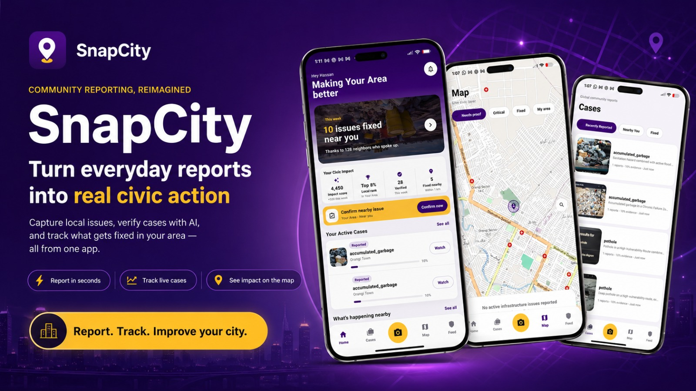
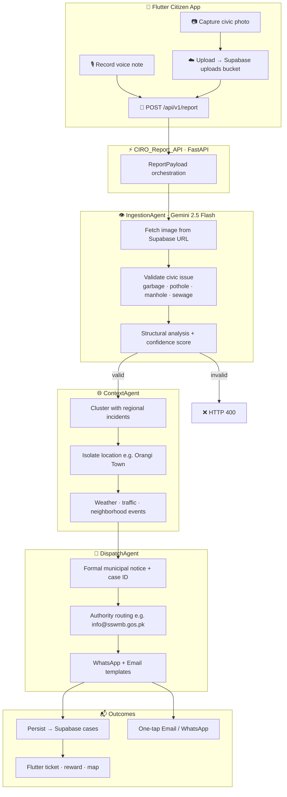

<div align="center">


# SnapCity

### AI-Powered Civic Hazard Reporting & Swarm Orchestration

_Turn every citizen snapshot into a validated, routed, and trackable municipal response — powered by Gemini multi-agent intelligence._

<br/>

[](https://flutter.dev)
[](https://fastapi.tiangolo.com)
[](https://supabase.com)
[](https://ai.google.dev)

<br/>

<!--
  BANNER PLACEHOLDER — Uncomment when your designer delivers the hero asset:

  
-->

<br/>

[Features](#-core-features) · [Architecture](#-system-architecture) · [Setup](#-local-setup--installation) · [Environment](#-environment-variables) · [Backend Docs](./backend/README.md) · [Frontend Docs](./frontend/README.md)

</div>

---

## The Problem & The Solution

- **The problem:** Civic hazards are reported through fragmented channels with no validation, weak location context, and slow hand-offs to the right municipal authority.
- **Our solution:** **SnapCity CIRO** (_Crisis Intelligence & Response Orchestrator_) — a **Flutter** citizen app and **FastAPI** agentic swarm that validates evidence with **Gemini 2.5 Flash**, fuses regional incident clusters, and simulates dispatch to authorities (e.g. **SSWMB Hyderabad** → `info@sswmb.gos.pk`) with one-tap **Email** or **WhatsApp**.
- **The impact:** Junk uploads are rejected before they enter the pipeline; duplicate clusters and neighborhood telemetry sharpen severity; gamified civic scores and case tracking keep citizens engaged after submission.

---

## Core Features

### Capture & Validation — Real-Time Visual Integrity Layer

**Gemini Vision** validates Supabase-hosted evidence via the **IngestionAgent** — classifying potholes, manholes, sewage, garbage, and road damage while returning a **structural analysis confidence score**. Invalid civic content is rejected at the API gate (`HTTP 400`).

|                                      Capture & Snap                                      |                                        AI Scan Pipeline                                        |
| :--------------------------------------------------------------------------------------: | :--------------------------------------------------------------------------------------------: |
|  |    |
|                                      **Demo Image**                                      |                                     **Ticket Generation**                                      |
|          |  |

---

### Live Telemetry — God Mode Agentic Swarm Control Center

Live-polling dashboard (`GET /api/v1/godmode/logs`, **2s interval**) streams NDJSON traces from **IngestionAgent**, **ContextAgent**, **ReasoningAgent**, **AuthorityFinderAgent**, and **DispatchAgent** during demos.

|                                       Telemetry Console                                        |                                        Agent Trace Stream                                        |
| :--------------------------------------------------------------------------------------------: | :----------------------------------------------------------------------------------------------: |
|  |  |

---

### Voice & Context — Voice Note Transcription Layer

Record voice notes on the civic ticket sheet; the UI shows an **AI voice translation preview** while `voice_note_transcript` is sent with GPS and image URL to `POST /api/v1/report` for multimodal swarm reasoning.

|                                        Civic Ticket Sheet                                        |                                         Civic Ticket Sheet 2                                         |                                     Voice Note UX                                      |
| :----------------------------------------------------------------------------------------------: | :--------------------------------------------------------------------------------------------------: | :------------------------------------------------------------------------------------: |
|  |  |  |

---

### Gamification — Civic Impact & Evidence Strength

Track **impact scores**, **local rank percentiles**, verified fixes, and **Evidence Strength** mechanics — High-severity swarm outcomes award up to **+40 Civic Impact Points** when cases are strengthened by cluster context.

|                                         Home Impact Dashboard                                          |                                                Reward & Evidence Strength                                                |                                   Cases Tab                                    |
| :----------------------------------------------------------------------------------------------------: | :----------------------------------------------------------------------------------------------------------------------: | :----------------------------------------------------------------------------: |
|  |  |  |

|                                   Feed Tab                                   |                                        Civic Map & Routing                                         |
| :--------------------------------------------------------------------------: | :------------------------------------------------------------------------------------------------: |
|  |  |

---

## Tech Stack

| Layer                  | Technology                                                                                                        | Role in SnapCity                                                                  |
| :--------------------- | :---------------------------------------------------------------------------------------------------------------- | :-------------------------------------------------------------------------------- |
| **Frontend**           |             | Cross-platform UI — camera, map, cases, feed, God Mode viewer                     |
| **Backend**            |             | CIRO REST API — `/api/v1/report`, `/api/v1/cases`, `/api/v1/godmode/*`            |
| **Database & Storage** |          | `uploads` bucket for evidence · `cases` table persistence                         |
| **AI Core**            |  | Agentic swarm — ingestion, context fusion, reasoning, authority routing, dispatch |

---

## System Architecture



**Swarm path:** Citizen payload → **CIRO_Report_API** → **IngestionAgent** → **ContextAgent** → **DispatchAgent** → unified response (Reasoning & AuthorityFinder agents run inline before dispatch in production).

---

## Local Setup & Installation

### Prerequisites

| Tool                 | Notes                            |
| :------------------- | :------------------------------- |
| **Python 3.11+**     | Backend environment              |
| **Flutter SDK**      | `sdk: ">=3.3.0 <4.0.0"`          |
| **Google AI Studio** | `GEMINI_API_KEY`                 |
| **Supabase**         | Bucket `uploads` + table `cases` |

### Backend — FastAPI

```bash
cd backend
conda create -n snapcity python=3.11 -y && conda activate snapcity
# or: python -m venv venv && source venv/bin/activate  (macOS/Linux)
# or: venv\Scripts\activate  (Windows)

pip install -r requirements.txt
cp .env.example .env
# Add GEMINI_API_KEY to .env

uvicorn main:app --reload --host 0.0.0.0 --port 8000
```

| Endpoint               | Method | Purpose              |
| :--------------------- | :----: | :------------------- |
| `/api/v1/report`       | `POST` | Full agentic swarm   |
| `/api/v1/cases`        | `GET`  | List persisted cases |
| `/api/v1/godmode/logs` | `GET`  | Live agent telemetry |

```bash
cd backend && python test_endpoint.py
```

Interactive docs: `http://127.0.0.1:8000/docs`

### Frontend — Flutter

```bash
cd frontend
flutter pub get
# Create frontend/.env (see Environment Variables)
# Set ApiService.activeBaseUrl in lib/services/api_service.dart

flutter run
```

**Web preview:**

```powershell
flutter build web --debug
node flutter_web_server.mjs
# Open http://127.0.0.1:5175
```

---

## Environment Variables

> `.env` files are gitignored — never commit production secrets.

### Backend (`backend/.env`)

| Variable         | Required | Description                                      |
| :--------------- | :------: | :----------------------------------------------- |
| `GEMINI_API_KEY` |    ✅    | Google AI Studio key for all Gemini swarm agents |

```bash
cd backend && cp .env.example .env
```

### Frontend (`frontend/.env`)

| Variable            | Required | Description                               |
| :------------------ | :------: | :---------------------------------------- |
| `SUPABASE_URL`      |    ✅    | Supabase project URL                      |
| `SUPABASE_ANON_KEY` |    ✅    | Anonymous key for `uploads` bucket writes |

### API base URL (`frontend/lib/services/api_service.dart`)

| Constant                     | When to use                        |
| :--------------------------- | :--------------------------------- |
| `optionA_productionUrl`      | Deployed Cloud Run backend         |
| `optionB_ldPlayerLocalUrl`   | Physical device on LAN             |
| `optionC_emulatorDefaultUrl` | Android emulator (`10.0.2.2:8000`) |

Set `activeBaseUrl` to match your dev environment.

---

## Repository Map

```
SnapCity/
├── README.md                    ← Master hackathon README
├── backend/                     ← FastAPI CIRO swarm
└── frontend/
    └── assets/outputs/          ← Context-named screenshots (14 files)
```

**Further reading:** [`backend/README.md`](backend/README.md) · [`frontend/README.md`](frontend/README.md) · [`frontend/lib/backend_contract.dart`](frontend/lib/backend_contract.dart)

---

<div align="center">

**Built for civic impact — one validated snap at a time.**

<br/>

_Google Antigravity Hackathon · SnapCity CIRO_

</div>
