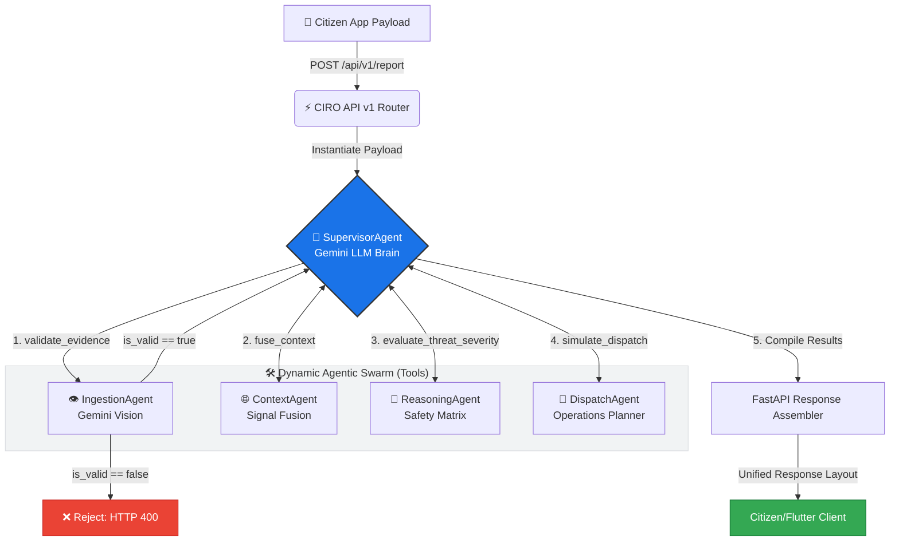

# SnapCity CIRO: Crisis Intelligence & Response Orchestrator

**A Multi-Agent Swarm driven by Google Antigravity for Automated Civic Crisis Ingestion, Signal Fusion, Threat Reasoning, and Coordinated Dispatch.**

---

## 🚀 Overview

**SnapCity CIRO** (Crisis Intelligence & Response Orchestrator) is a state-of-the-art, fully generative multi-agent AI system built using the standard Python **Google GenAI / Gemini** ecosystem. 

CIRO coordinates a dynamic, autonomous **Agentic Swarm** overseen by a central **Supervisor Agent** using Gemini function-calling (Tool-Use). Instead of a rigid, hardcoded sequential pipeline, the Supervisor acts as the "brain"—analyzing the incoming report and deciding dynamically which sub-agent tool to run, in what order, and when to halt execution (providing immediate guardrail rejections).




---

## 🛠️ Installation & Environment Setup

CIRO is packaged as a standard, fully decoupled FastAPI web backend. Run the following commands in your shell to build and configure your environment:

```bash
# 1. Create a dedicated Python 3.11 conda environment
conda create -n snapcity python=3.11 -y

# 2. Activate your new environment
conda activate snapcity

# 3. Install core packages and Gemini GenAI dependencies
pip install -r requirements.txt
```

### Configure Environment Variables
Duplicate the example environment template and add your Google Gemini API key:
```bash
cp .env.example .env
```
Open your newly created `.env` file and insert your actual API key:
```env
# Mandatory: Your Google Gemini API Key from Google AI Studio (Free Tier is fully supported)
GEMINI_API_KEY=your_google_api_key_here
```

---

## 🤖 The Agentic Swarm & Tool-Use Architecture

CIRO organizes your AI agents as a **Dynamic Tool-Calling Swarm** overseen by a central Supervisor Agent. Instead of hardcoding their relationships, sub-agents are exposed as Python tools, allowing the Supervisor (using Gemini Function-Calling) to coordinate them autonomously:

| Agent / Service Name | Emojis | Department Role | Primary Tools / Actions Mapped |
| :--- | :---: | :--- | :--- |
| **Supervisor Agent** | `🤖` | **The Brain**. Evaluates the active request, calls sub-agents sequentially, processes rejections, and compiles the final contract. | • Coordinates the active tool-calling loop<br>• Controls the early-exit validation guardrail |
| **Ingestion Agent** | `👁️` | Multimodal parser. Extracts core categories, verbal intents, and analyzes visual imagery. | • `validate_evidence` (Gemini: multimodal analysis)<br>• Uses smart fallback images matching transcript keywords for offline testing |
| **Context Agent** | `🌐` | Signal fusion engine. Aggregates GPS coordinates with environmental weather and traffic data. | • `fuse_context` (Fuses telemetry sensors)<br>• Connects to standard weather & traffic feeds |
| **Reasoning Agent** | `🧠` | Intellectual core. Evaluates combined environmental threat vectors using safety heuristics. | • `evaluate_threat_severity` (Calculates dynamic hazard levels) |
| **Dispatch Agent** | `🚒` | Operations planner. Assigns municipal responders, simulates action timelines, and drafts notifications. | • `simulate_dispatch` (Compiles templates, Rewards and ETA) |
| **Authority Finder** | `📝` | Geo-boundary router. Matches Pakistan municipal agencies deterministically. | • Relocated to `services/AuthorityFinderService` for clean architectural separation |

### 🛡️ Safety Fail-Safe & API Redundancy
* **GenAI Fallback Sequence**: When evaluating decisions, the swarm utilizes a robust dual-fallback tier. It compiles structured schemas via `gemini-3.1-flash-lite` (primary free model), seamlessly downgrades to `gemini-2.5-flash` in case of rate limits, and automatically routes to a **deterministic local backup rule-path** if the internet or API is fully unreachable. Your city backend never halts!
* **Structured Outputs**: All agents enforce rigid **Pydantic schemas** which are strictly validated upon receipt, preventing AI hallucinations.

---

## 📱 Flutter Application Integration

Integrating the backend with your Flutter mobile application is incredibly straightforward. The API handles all signal-processing logic, returning a single rich JSON packet containing all agent actions, warnings, and copy-paste notification text blocks.

### 1. HTTP Request Payload (Flutter ➡️ FastAPI)
The Flutter app makes a `POST` request to `http://<your-server-ip>:8000/api/v1/report` with the following JSON body:

```json
{
  "report_id": "rep_10293",
  "image_url": "https://storage.mock/images/issue_01.jpg", 
  "gps": {
    "lat": 24.9180,
    "lng": 67.0971
  },
  "voice_note_transcript": "There is a deep open manhole on the main school route causing severe danger for kids walking home in this storm."
}
```

### 2. HTTP Response Payload (FastAPI ➡️ Flutter)
The backend responds with `200 OK` and a rich JSON structure:

```json
{
  "report_id": "rep_10293",
  "status": "success",
  "detection": {
    "issue_type": "open_manhole",
    "confidence_score": 100,
    "visual_evidence": "The provided image is a solid red color, which does not contain visual info. However, user voice note explicitly states an open manhole."
  },
  "context": {
    "weather": "Heavy Rain",
    "traffic": "Heavy",
    "duplicate_cluster_id": "cluster_88A",
    "historical_data": {
      "previous_failures": 2,
      "last_failure_date": "2025-11-10",
      "chronic_issue": true
    },
    "area": "Block 13, Gulshan-e-Iqbal, Karachi",
    "weather_condition": "Heavy rain causing localized surface runoff...",
    "traffic_impact": "Gridlock risk due to lane obstruction...",
    "similar_reports_nearby": 8
  },
  "reasoning": {
    "confidence_score": 95,
    "impact_level": "High",
    "severity_level": "High",
    "escalation_reason": "Open manhole in active flood zone + heavy rain + high traffic area creates immediate life-safety risk."
  },
  "simulation_outcome": {
    "case_id": "SC-842",
    "assigned_responder": "NGO FixIt",
    "municipal_notice_drafted": "URGENT: High impact open_manhole detected at 24.9180, 67.0971. Expected rain exacerbating risk. Assigned to NGO FixIt.",
    "estimated_resolution_time": "2 hours",
    "user_reward": {
      "civic_points_earned": 40,
      "message": "Your report strengthened this case by +24%!"
    }
  },
  "dispatch_simulation": {
    "whatsapp_template": "*SnapCity Alert!*\n*Case:* SC-842\n*Issue:* Open Manhole...",
    "email_template": "Subject: ESCALATION: Critical Open Manhole...",
    "internal_thought": "The case was classified as High severity due to..."
  },
  "classification": "Open Manhole"
}
```

### 3. Direct Key Mapping for Flutter Widgets:
Use this direct mapping guide to bind backend JSON keys to styled Flutter widgets:

| UI Widget / Feature | Dart JSON Extraction Path | Sample Extracted Value |
| :--- | :--- | :--- |
| **Category Label** | `response['detection']['issue_type']` | `"open_manhole"` |
| **Confidence Indicator** | `response['detection']['confidence_score']` | `100` (Int) |
| **Visual Confirmation Summary** | `response['detection']['visual_evidence']` | `"The provided image is..."` |
| **Resolved Neighborhood** | `response['context']['area']` | `"Block 13, Gulshan-e-Iqbal, Karachi"` |
| **Environmental Badges** | `response['context']['similar_reports_nearby']` | `8` (Int) |
| **Threat Level Badge** | `response['reasoning']['severity_level']` | `"High"` (e.g. Render in Red) |
| **Escalation Danger Text** | `response['reasoning']['escalation_reason']` | `"Open manhole in active..."` |
| **Assigned Responder** | `response['simulation_outcome']['assigned_responder']` | `"NGO FixIt"` (NGO logo/card) |
| **ETA Progress Indicator** | `response['simulation_outcome']['estimated_resolution_time']` | `"2 hours"` (Visual clock widget) |
| **Copy WhatsApp Button** | `response['dispatch_simulation']['whatsapp_template']` | `*SnapCity Alert!* \nCase:...` (Clipboard) |
| **Citizen Points Earned** | `response['simulation_outcome']['user_reward']['civic_points_earned']` | `40` (Points addition animation) |
| **Citizen Encouragement** | `response['simulation_outcome']['user_reward']['message']` | `"Your report strengthened..."` |

---

## 🔌 Transitioning from Mock to Production APIs (Optional)

To upgrade the CIRO system from simulated MVP data to real-world production telemetry, replace the modular providers in the `services/` directory with live external APIs:

### 1. Weather Sensors (`services/mock_weather.py`)
* **Current Mock**: Returns a static string `"Heavy Rain"`.
* **Production Path**: Integrate the **OpenWeatherMap API** or **WeatherAPI** to fetch real-world current weather based on coordinates using `httpx`:
  ```python
  import httpx
  async def get_weather(lat: float, lng: float) -> str:
      url = f"https://api.openweathermap.org/data/2.5/weather?lat={lat}&lon={lng}&appid={API_KEY}"
      async with httpx.AsyncClient() as client:
          response = await client.get(url)
          data = response.json()
          return data["weather"][0]["main"] # e.g. "Rain", "Thunderstorm"
  ```

### 2. Real-World Traffic Telemetry & Geocoding (`services/traffic.py`)
* **Implemented Setup**: CIRO now uses a production-ready **dual-provider reverse lookup engine**:
  1. **Primary**: **OpenStreetMap (OSM) Nominatim API** (100% free, keyless) to reverse-geocode coordinates into real roads (e.g. `Rashid Minhas Road`) and compute dynamic density metrics depending on road classification (`primary`, `residential`, etc.).
  2. **Secondary Fallback**: **Google Maps Directions & Geocoding APIs** (active if `GOOGLE_MAPS_API_KEY` is added to `.env` and OSM fails).
  3. **Tertiary Fallback**: Safe fallback heuristic values to guarantee service uptime.
* **Production Path**: You can connect this class directly to the paid **Google Maps Distance Matrix API** to measure duration-in-traffic delays:
  ```python
  import httpx
  async def get_traffic(lat: float, lng: float) -> str:
      url = f"https://maps.googleapis.com/maps/api/distancematrix/json?origins={lat},{lng}&destinations={lat+0.01},{lng+0.01}&departure_time=now&traffic_model=best_guess&key={GOOGLE_KEY}"
      async with httpx.AsyncClient() as client:
          response = await client.get(url)
          duration_in_traffic = response.json()["rows"][0]["elements"][0]["duration_in_traffic"]["value"]
          duration = response.json()["rows"][0]["elements"][0]["duration"]["value"]
          return "Heavy" if duration_in_traffic > duration * 1.5 else "Normal"
  ```

### 3. Spatial Proximity Triangulation & Duplicate Queries
* **Current Mock**: Hardcoded active duplicate clusters in Karachi (`similar_reports_nearby=8`).
* **Production Path**: Integrate a spatial database (like **PostgreSQL** with **PostGIS**) using **SQLAlchemy** or **tortoise-orm** to dynamically count nearby duplicate reports of the same category within a 200-meter geographic radius over the last 24 hours:
  ```python
  # Example PostGIS Query to fetch duplicate cluster count:
  # SELECT COUNT(*) FROM reports 
  # WHERE ST_DWithin(gps_point, ST_MakePoint(:lat, :lng)::geography, 200) 
  #   AND issue_type = :issue_type 
  #   AND created_at > NOW() - INTERVAL '24 hours';
  ```

---

## ⚡ Running the Servers

### Start the Live FastAPI Backend Reload Server:
```bash
uvicorn main:app --reload
```

### Run the Swarm Integration Test:
```bash
python test_endpoint.py
```

### Audit Trace Logs (With Dynamic Terminal Emojis):
* Text log with timestamps and emojis: [agent_traces.log](./agent_traces.log)
* Structured log file (NDJSON format): [agent_traces.json](./agent_traces.json)
